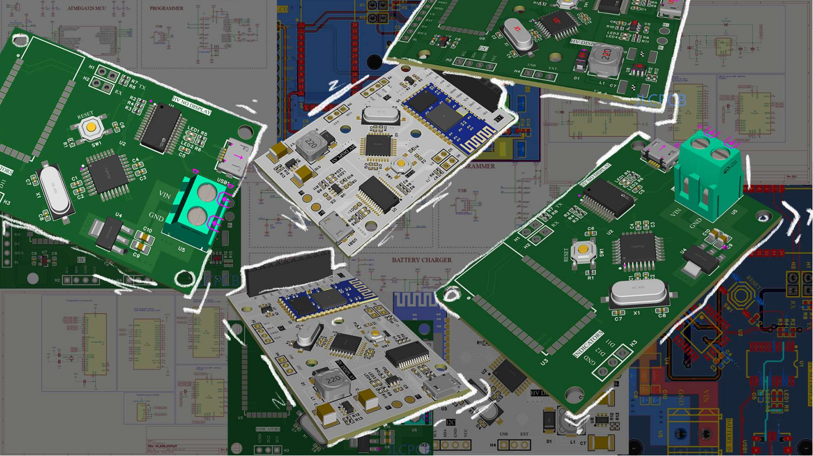
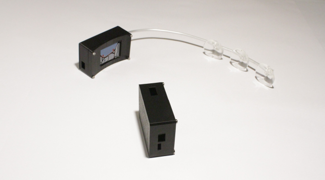
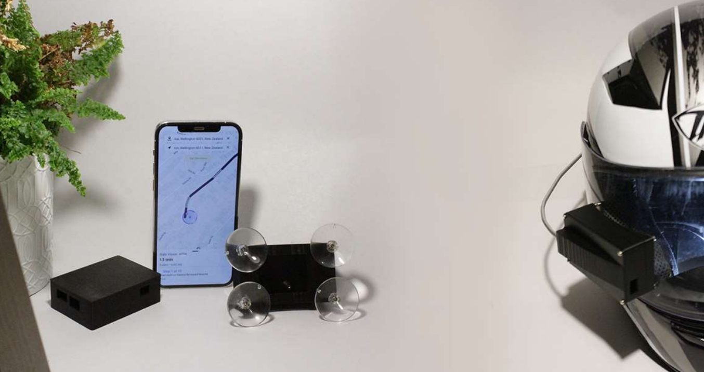
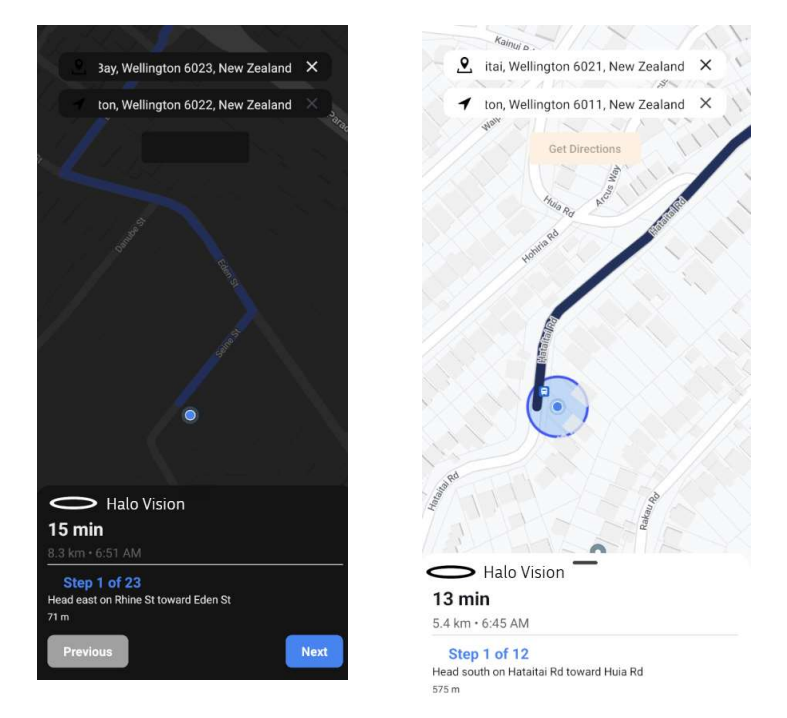

# Halo Vision

**Open-Source Heads-Up Display for Motorcycle Safety**

Halo Vision is a helmet-mounted HUD that delivers turn-by-turn navigation and indicator notifications to motorcyclists, hands-free. Inspired by personal experiences, it evolved from a simple indicator broadcaster into a full display system with custom PCBs and a companion mobile app.

---

## 🚀 What’s in this Repo

- **Schematics**    
  See [`/schematics/README.md`](schematics/README.md).  
  Organized by module under `/schematics/`:
  - **Brain Module** and **Display Module** each have a `Project Outputs/` folder containing:  
    - **3D Views**  
    - **BOM (JLCPCB)**  
    - **Gerber**  
    - **JLCPCB Quotation**  
    - **Pick and Place**  
    - **Schematic** (PDF/PNG)  
    - **STEP** files  
    - **Source Files** (KiCad/Eagle project)  
    - **Original sketches**  
  These folders include all fabrication data and documentation for both the Brain and Display modules.    
  - ATmega32U2 pin mapping and net labels for easy modification  
  

- **Software**  
  See [`/software/README.md`](software/README.md).  
  Organized under `/software/`:
  - **firmware/**
    - **brain_module/**  
      - `Makefile`  
      - `include/`  
        - `config.h`  
        - **hal/**: `gpio.h`, `uart.h`, `i2c.h`  
        - **modules/**: `gps.h`, `ble_uart.h`, `battery.h`  
      - `src/`  
        - `main.c`  
        - **hal/**: `gpio.c`, `uart.c`, `i2c.c`  
        - **drivers/**: `gps_driver.c`, `ble_uart.c`, `battery_monitor.c`  
        - **modules/**: `nav_logic.c`, `signal_detector.c`  
        - **util/**: `ring_buffer.c`, `logger.c`  
    - **display_module/**  
      - `Makefile`  
      - `include/`  
        - `config.h`  
        - **hal/**: `gpio.h`, `spi.h`, `uart.h`  
        - **modules/**: `display_driver.h`, `ble_rx.h`  
      - `src/`  
        - `main.c`  
        - **hal/**: `gpio.c`, `spi.c`, `uart.c`  
        - **drivers/**: `lcd_driver.c`, `ble_rx.c`  
        - **modules/**: `screen_updater.c`, `battery_status.c`  
        - **util/**: `ring_buffer.c`, `logger.c`  
  - **host_tools/**  
    - `flash_firmware.py`  
    - `diagnostics.py`  
  

- **CAD Models & 3D Prints**  
  See [`/cad/README.md`](cad/README.md).  
  All in `/cad/`:
  - **Helmet housing** (`helmet_housing.step`, `helmet_housing.stl`)  
  - **Mount styles**:  
    - `mount_clip.stl` (clip-on)  
    - `mount_screw.stl` (screw-on bracket)  
    - `mount_magnet.stl` (magnetic quick-release)  
  - **Print Guidance** (`/cad/print_settings.md`) lists filament recommendations, print settings, and screw types  
  

- **Mobile App**  
  See [`/app/README.md`](app/README.md).  
  Joel Bannister’s Android navigator app threads GPS data to the HUD over Bluetooth:  
  https://github.com/1ceseismic/android_mapbox_lcd_navigator  
  

---

## 🏁 Getting Started

1. **Clone** this repo  
   ```bash
   git clone https://github.com/YourUsername/HaloVision.git
Browse each subfolder’s README for step-by-step build & install instructions.

Flash the firmware, 3D-print your chosen mount, and pair your phone.

🤝 Contributing
This project is 100% open-source. Contributions, issues, and pull requests are warmly welcomed!

📄 License
Distributed under the MIT License. See LICENSE for details.

Email me for further edits: kahu@kora.ac