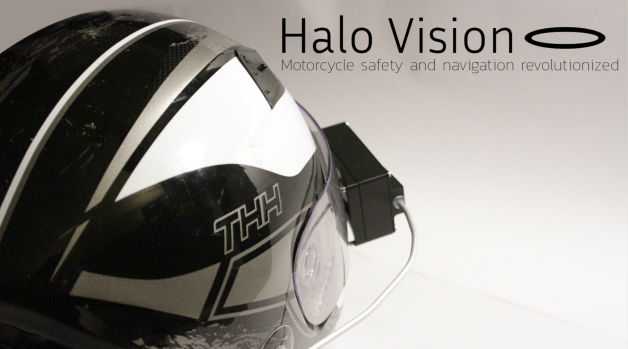

# Halo Vision

**Open-Source Heads-Up Display for Motorcycle Safety**

Halo Vision is a helmet-mounted HUD that delivers turn-by-turn navigation and indicator notifications to motorcyclists, hands-free. Inspired by personal experiences, it evolved from a simple indicator broadcaster into a full display system with custom PCBs and a companion mobile app.

A full report—including detailed design motivations, hardware walkthrough, and CFD analysis—is available at:  
https://www.kahuhutton.com/work/halo-vision

---

## 🚀 What’s in this Repo

- **Schematics**    
  See [`/schematics/README.md`](schematics/schematics_readme.md).  
  Organized by module under `/schematics/`:
  - **Brain Module** and **Display Module** each have a `Project Outputs/` folder containing:  
    - **3D Views**  
    - **BOM (JLCPCB)**  
    - **Gerber**  
    - **JLCPCB Quotation**  
    - **Pick and Place**  
    - **Schematic** (PDF/PNG)  
    - **STEP** files  
    - **Source Files** (KiCad/Eagle project)  
    - **Original sketches**  
  These folders include all fabrication data and documentation for both the Brain and Display modules.    
  - ATmega32U2 pin mapping and net labels for easy modification  
  

- **Software**  
  See [`/software/README.md`](software/software_readme.md).  
  Organized under `/software/`:
  - **firmware/**
    - **brain_module/**  
      - `Makefile`  
      - `include/`  
        - `config.h`  
        - **hal/**: `gpio.h`, `uart.h`, `i2c.h`  
        - **modules/**: `gps.h`, `ble_uart.h`, `battery.h`  
      - `src/`  
        - `main.c`  
        - **hal/**: `gpio.c`, `uart.c`, `i2c.c`  
        - **drivers/**: `gps_driver.c`, `ble_uart.c`, `battery_monitor.c`  
        - **modules/**: `nav_logic.c`, `signal_detector.c`  
        - **util/**: `ring_buffer.c`, `logger.c`  
    - **display_module/**  
      - `Makefile`  
      - `include/`  
        - `config.h`  
        - **hal/**: `gpio.h`, `spi.h`, `uart.h`  
        - **modules/**: `display_driver.h`, `ble_rx.h`  
      - `src/`  
        - `main.c`  
        - **hal/**: `gpio.c`, `spi.c`, `uart.c`  
        - **drivers/**: `lcd_driver.c`, `ble_rx.c`  
        - **modules/**: `screen_updater.c`, `battery_status.c`  
        - **util/**: `ring_buffer.c`, `logger.c`  
  - **host_tools/**  
    - `flash_firmware.py`  
    - `diagnostics.py`  
  

## CAD Models & 3D Prints

All CAD assets live under the `/cad/` folder, organized by module. Each sub-folder includes a SolidWorks assembly (`.SLDASM`) plus its corresponding part files (`.SLDPRT`).  

**Module folders:**  
- `brainmodule/` – electronics housing assemblies and parts  
- `displaymodule/` – display housing assemblies and parts  
- `misc/` – hardware components (bolts, spacers, etc.)  

**Mount options:**  
- **HaloMount** – bracketed mount for helmet rim installation  
- **Direct Mount** – low-profile mount for direct shell attachment  

For print parameters, materials, and recommended hardware, see [`/cad/print_settings.md`](cad/print_settings.md).  
 
  

- **Mobile App**  
  See [`/app/README.md`](app/README.md).  
  Joel Bannister’s Android navigator app threads GPS data to the HUD over Bluetooth:  
  https://github.com/1ceseismic/android_mapbox_lcd_navigator  
  

---

## 🏁 Getting Started

Follow these steps to take your Halo Vision from GitHub to helmet-mounted HUD:

### 1. Clone this repo
```bash
git clone https://github.com/YourUsername/HaloVision.git
cd HaloVision
```

### 2. Order PCBs
- Open `/schematics/brain_module/Project Outputs/BOM (JLCPCB)/BOM.csv` and `/schematics/display_module/Project Outputs/BOM (JLCPCB)/BOM.csv`
- Upload both CSVs to JLCPCB (or your favorite board house) to fabricate the Brain and Display modules

### 3. 3D-print mounts & housings
- Choose a mount style (HaloMount, Direct Mount, etc.) in `/cad/`
- Follow `/cad/print_settings.md` for filament type, layer height, infill, and recommended screws

### 4. Build & flash firmware

**Brain Module:**
```bash
cd software/firmware/brain_module
make all
make flash
```

**Display Module:**
```bash
cd ../../display_module
make all
make flash
```

### 5. Install the mobile app
```bash
git clone https://github.com/1ceseismic/android_mapbox_lcd_navigator.git
```
Import into Android Studio, configure your Mapbox token, then build & install the APK on your device.

### 6. Assemble & power up
- Populate each PCB with the ordered components and solder per the assembly drawings
- Mount the PCBs in your 3D-printed housings and secure with the recommended screws
- Connect a Li-Po battery to each module's power header

### 7. Pair & test
- On your phone, open the installed app and pair to the HaloVisionHUD (PIN: 1234)
- Turn on the Brain Module (bike) and Display Module (helmet)
- Verify GPS lock, turn-signal detection, and live HUD updates before your next ride

---

Now you're ready to ride with Halo Vision. Enjoy hands-free navigation and stay safe!

📄 License
Distributed under the MIT License. See LICENSE for details.

Email me for further edits: kahu@kora.ac
